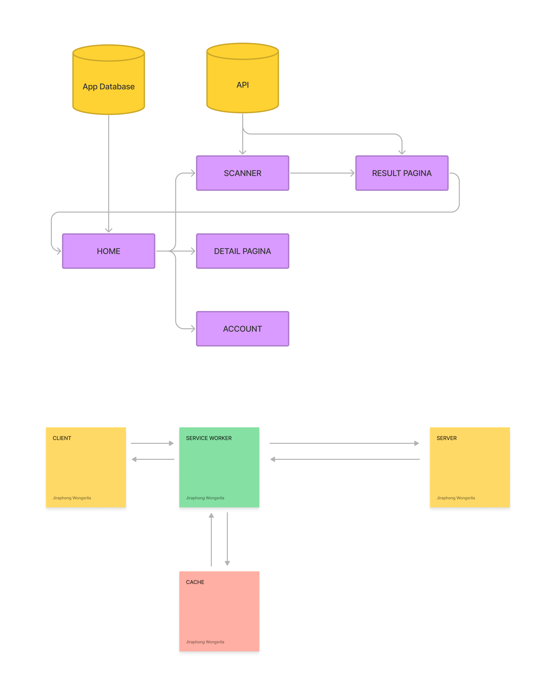
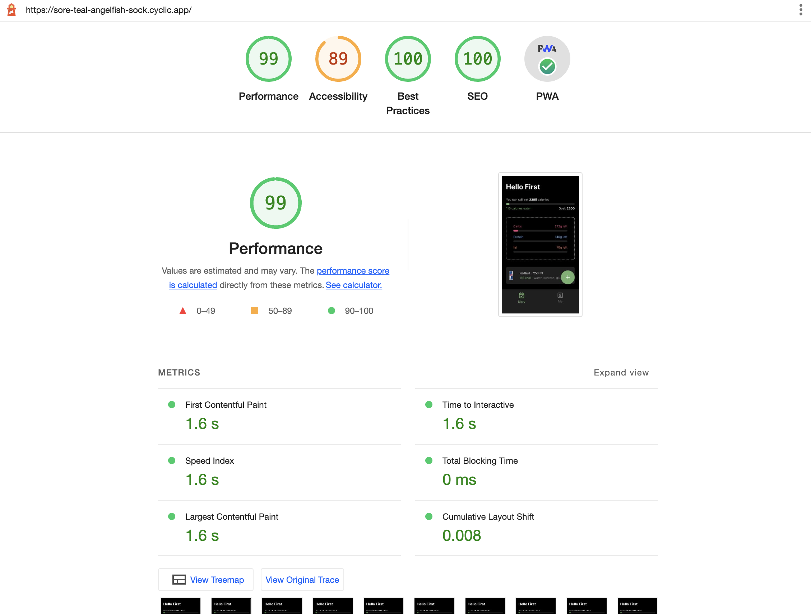
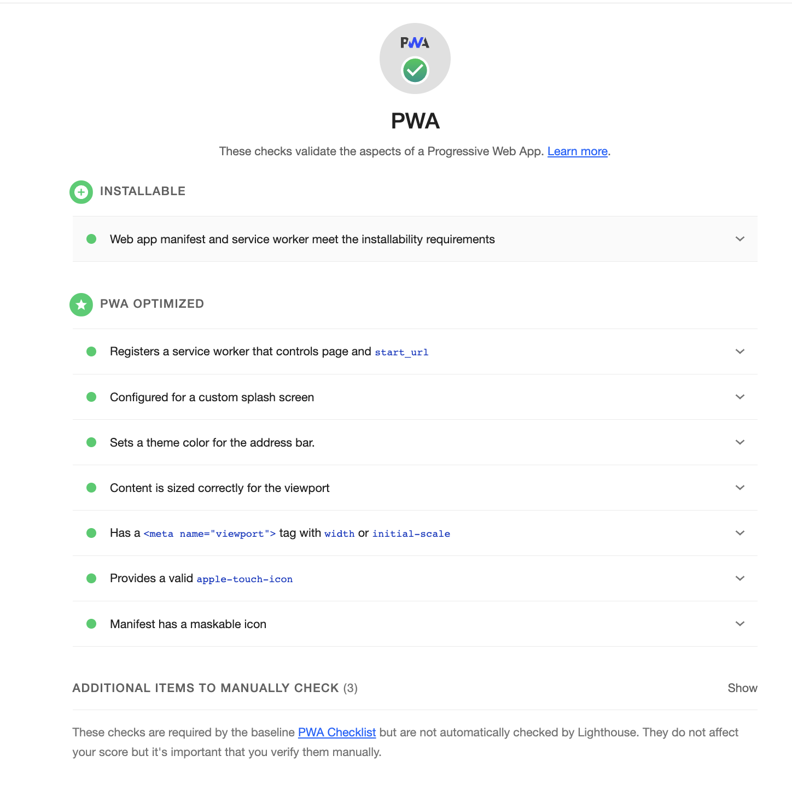

# Progressive Web Apps @cmda-minor-web 2022 - 2023

Welkom bij de Yummiespot Voedsel Barcode Scanner App repository! Yummiespot is een gemakkelijk te gebruiken mobiele applicatie waarmee gebruikers snel de barcode van voedselproducten kunnen scannen en gedetailleerde informatie erover kunnen opvragen.

Het doel van Yummiespot is om gebruikers te helpen geïnformeerde beslissingen te nemen over het voedsel dat ze consumeren. Door gedetailleerde informatie te verstrekken over ingrediënten, voedingsinformatie en allergenen, stelt Yummiespot gebruikers in staat om gezonde keuzes te maken die voldoen aan hun dieetbehoeften.


Ik heb de opdracht barcode scanner gekozen omdat dit mij het meest aantrok. Zelf ben ik ook bezig met het bijhouden van de eten die eet. Mijn vriendin heeft ook een food blog. Daarom heb ik deze keuze gemaakt. Waar ik als eerst aan dacht was het maken van een food app waar mensen hun eten kunnen tracken en dan kunnen zien hoeveel calorieën ze op die dag hebben gegeten. Zelf weet ik dat dit een hele uitdaging gaat worden omdat ik überhaupt nog niet weet hoe ik een barcodescanner moet maken. Ook heb ik ruim een jaar niet meer gecodeerd dus moet ik weer helemaal inkomen hoe Javascript ook al weer werkt.

Voor deze opdracht hebben we ook een api gekregen waarmee we heel veel producten op kunnen halen met meta data zoals `calories`, `protein` en `carbs`, maar ook `ingredients` en `categories`. [OpenFoodFacts](https://openfoodfacts.github.io/api-documentation/)



## MVC Model

MVC (Model-View-Controller) is een software ontwerppatroon dat wordt gebruikt om de structuur van een webapplicatie te organiseren. Het scheidt de applicatie in drie componenten: de model (gegevens), de view (presentatie) en de controller (logica).

In Node.js wordt MVC vaak gebruikt in combinatie met Express.js. In dit patroon wordt de routing en logica van de applicatie behandeld door de controller, de data wordt beheerd door de model en de presentatie van de gegevens wordt gedaan door de view. Ik heb zelf ook the routing weer opgesplitst.

Het gebruik van MVC in Node.js maakt de code beter georganiseerd, gemakkelijker te onderhouden en meer schaalbaar, waardoor het een populaire keuze is voor de ontwikkeling van webapplicaties.

## Serverside Rendering

Serverside rendering (SSR) is een techniek waarbij webpagina's worden gerenderd op de server in plaats van op de client (browser). Serverside rendering (SSR) met Express.js is een manier om de prestaties van webapplicaties te verbeteren door de HTML-pagina's op de server te genereren en deze vervolgens naar de browser te sturen. Dit kan de laadtijd van de pagina verkorten en de gebruikerservaring verbeteren. Bovendien kan SSR de zoekmachineoptimalisatie (SEO) verbeteren omdat zoekmachines beter in staat zijn om inhoud op de pagina te indexeren.

Als view template gebruik ik .ejs Dit is makkelijk te begrijpen en je behoud de layout van HTML.

```javascript
const productGet = (req, res) => {
  Product.findById(req.params.barcode)
    .then((product) => {
      res.render('product', { product });
    })
    .catch((err) => console.error(err));
};
```

Dit is een voorbeeld van een functie die wordt uitgevoerd door een route. Vervolgens zoekt hij data op vanuit de database en `res.render` die het naar de client.

## Routing

Om mijn routing zo overzichtelijk mogelijk te maken heb ik die ook opgesplitst van de controller. Zo kan ik op 1 plek alle routes aanpassen die nodig zijn. Vervolgens exporteer in de router naar de server.js en importeer ik de controllers naar deze routes.

```javascript
const express = require('express');
const indexController = require('../controllers/indexController');
const accountController = require('../controllers/accountController');

const router = express.Router();

router.get('/', indexController.indexGet);
router.get('/product/:barcode', indexController.productGet);
router.get('/scanner', indexController.scannerGet);
router.get('/result/:barcode', indexController.resultGet);
router.post('/save', indexController.savePost);
router.post('/delete', indexController.deletePost);

// Account Routes
router.get('/account', accountController.indexGet);

// Offline route
router.get('/offline', indexController.offlineGet);

module.exports = router;
```

## Optimzing the app

Ik heb een lighthouse test gedaan en vervolgens de meeste puntjes een voor een van gegaan. Mijn prioriteit was dat ik de PWA gedeelte 100% had. Sinds dat de opdracht is.





## Critical Rendering Path

Ik hebben ervoor gekozen om de perceived load speed en load responsiveness te optimaliseren, aangezien ik dit heb geïdentificeerd als gebieden waar de applicatie aanzienlijk kon verbeteren. Ik heb de statische bestanden van de Javascript en de CSS verkleind. Het implementeren van cachingstrategieën leidde ook tot betere laadprestaties bij herhaalde bezoeken aan onze applicatie.

```javascript
const CORE_CACHE = 1;
const CORE_CACHE_NAME = `core-v${CORE_CACHE}`;
const CORE_ASSETS = [
  'manifest.json',
  '/offline',
  '/account',
  '/scanner',
  'css/main.css',
  'js/main.js',
];

self.addEventListener('install', (event) => {
  event.waitUntil(
    caches.open(CORE_CACHE_NAME).then((cache) => {
      console.log('caching static assets');
      cache.addAll(CORE_ASSETS);
    }),
  );
});

self.addEventListener('activate', (event) => {
  console.log('Activated');
});

self.addEventListener('fetch', (event) => {
  const req = event.request;
  console.log('Fetching:' + req.url);

  event.respondWith(
    fetch(req)
      .then((fetchRes) => {
        return caches.open(CORE_CACHE_NAME).then((cache) => {
          cache.put(req, fetchRes.clone());
          return fetchRes;
        });
      })
      .catch((err) => {
        return caches.match(req).then((cachedRes) => {
          if (cachedRes) {
            return cachedRes;
          } else {
            return caches
              .open(CORE_CACHE_NAME)
              .then((cache) => cache.match('/offline'));
          }
        });
      }),
  );
});
```

Ook heb ik lazy loading toegepast. Dit helpt ook met de gebruikerservaring. Zo hoeft niet alle onzigbare foto's al geladen te worden.

```html
" />
```

Ten slotte verbeterde ik het uitstellen en asynchroon laden van niet-kritieke JavaScript en CSS. Dit heb ik gedaan door DEFER te gebruiken op de scripts.

```html
<script defer src="/js/main.min.js"></script>
<script defer src="/js/scanner.min.js"></script>
```

Deze gecombineerde optimalisaties hebben geleid tot een snellere, responsievere applicatie, wat de algehele gebruikerservaring verbetert.
